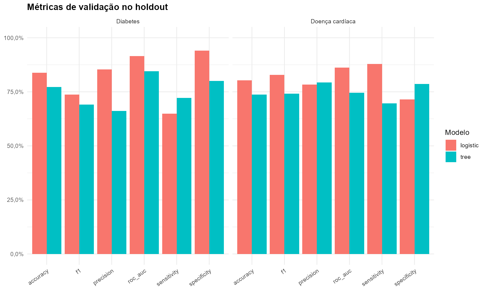
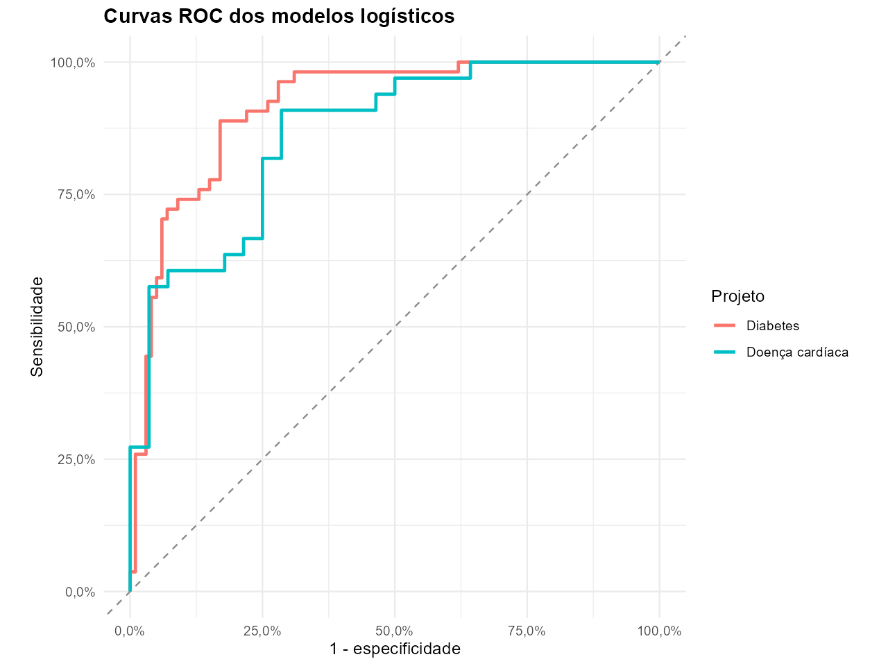
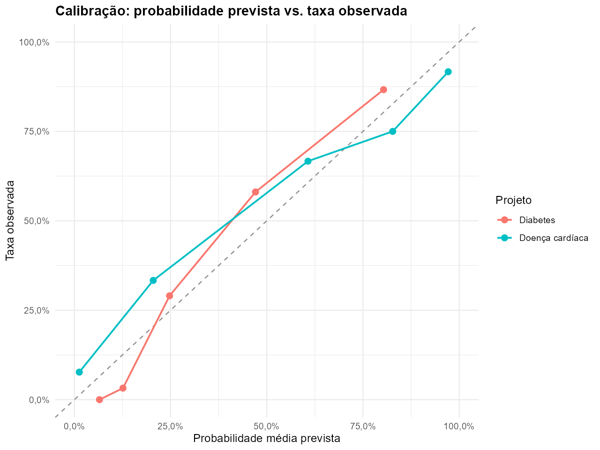
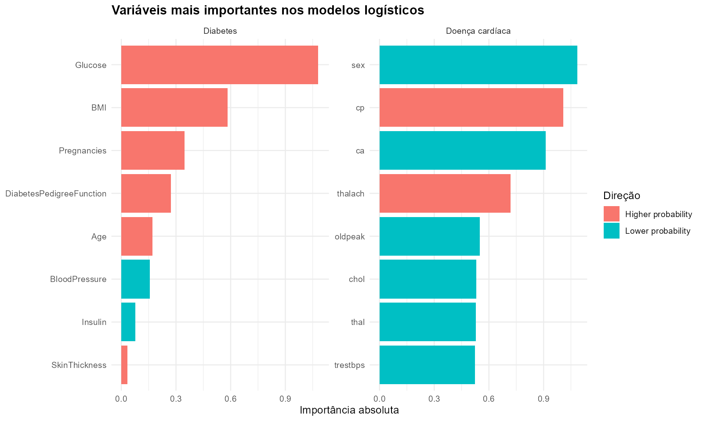
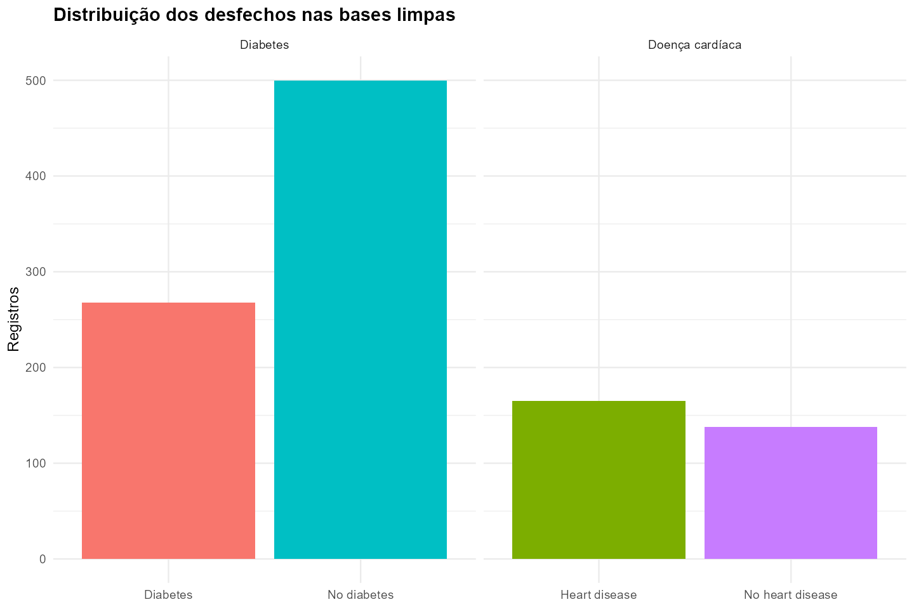
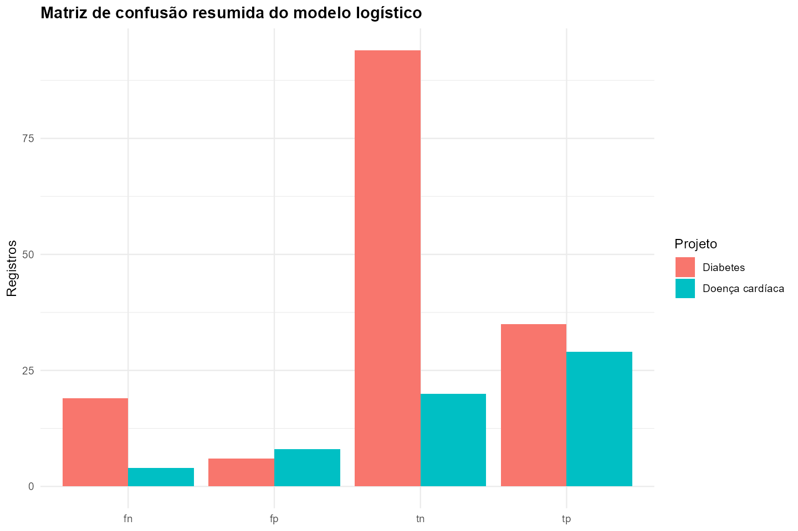

# Modelagem Clínica e Validação Estatística

**Classificação supervisionada aplicada a diabetes e doença cardíaca, com foco em validação, calibração e interpretabilidade**


---

## Dashboard interativo

**[Abrir dashboard online](https://matheusassiso.github.io/saude-modelagem-clinica-validacao/)**

Dashboard executivo com métricas de validação, curva ROC, calibração, importância de variáveis, distribuição dos desfechos e matriz de confusão.



---

## Objetivo

Integrar dois estudos de modelagem clínica em um único projeto profissional:

1. classificação de diabetes;
2. classificação de doença cardíaca;
3. validação holdout e validação cruzada;
4. calibração e interpretabilidade.

A pergunta central é:

> Como apresentar modelos clínicos de classificação de forma profissional, mostrando desempenho, calibração, interpretação e limites de uso?

---

## Motivação

Modelos clínicos não devem ser avaliados apenas por acurácia. Uma apresentação profissional precisa mostrar discriminação, sensibilidade, especificidade, calibração, matriz de confusão e variáveis relevantes. Esse projeto organiza esses elementos para comunicar maturidade analítica em modelagem preditiva.

---

## Dados

| Dimensão | Conteúdo | Indicadores usados |
|---|---|---|
| Diabetes | base clínica tabular limpa | glicose, IMC, idade, histórico familiar e desfecho |
| Doença cardíaca | base clínica tabular limpa | idade, colesterol, pressão, dor torácica, frequência máxima e desfecho |
| Validação | métricas finais e validação cruzada | acurácia, sensibilidade, especificidade, precisão, F1 e AUC |
| Calibração | probabilidades por faixas | probabilidade média e taxa observada |
| Interpretabilidade | coeficientes e importância | direção e importância absoluta das variáveis |

---

## Método

```text
Bases limpas → modelos supervisionados → holdout e validação cruzada
→ ROC → calibração → interpretabilidade → dashboard e relatório
```

Etapas principais:

1. organização dos resultados finais em `data/source/`;
2. consolidação das métricas em `data/processed/`;
3. comparação dos modelos por projeto;
4. geração de figuras de validação;
5. publicação em RMarkdown, PDF, HTML e dashboard.

---

## Resultados principais

| Projeto | Melhor modelo | AUC | Acurácia | Sensibilidade | Especificidade |
|---|---|---:|---:|---:|---:|
| Diabetes | Logístico | 91,6% | 83,8% | 64,8% | 94,0% |
| Doença cardíaca | Logístico | 86,3% | 80,3% | 87,9% | 71,4% |

---

## Evidências visuais

### Métricas holdout


### Curvas ROC



### Calibração



### Importância de variáveis



### Distribuição dos desfechos



### Matriz de confusão



---

## Entregáveis

- [Dashboard interativo online](https://matheusassiso.github.io/saude-modelagem-clinica-validacao/)
- [Arquivo HTML do dashboard](docs/modelagem_clinica_dashboard.html)
- [Relatório PDF](modelagem_clinica_validacao.pdf)
- [Relatório RMarkdown](modelagem_clinica_validacao.Rmd)
- [Relatório HTML](docs/relatorio.html)
- [Métricas consolidadas](data/processed/metricas_modelos.csv)
- [Curvas ROC](data/processed/curvas_roc.csv)
- [Calibração](data/processed/calibracao_modelos.csv)

---

## Estrutura

```text
.
├── data/
│   ├── source/
│   └── processed/
├── docs/
│   ├── index.html
│   ├── modelagem_clinica_dashboard.html
│   └── relatorio.html
├── figures/
├── scripts/
│   └── build_project.R
├── modelagem_clinica_validacao.Rmd
├── modelagem_clinica_validacao.pdf
├── saude-modelagem-clinica-validacao.Rproj
└── COMMIT_INSTRUCTIONS.txt
```

---

## Como reproduzir

Abra `saude-modelagem-clinica-validacao.Rproj` no RStudio e execute:

```r
source("scripts/build_project.R")
```

O script reconstrói dados consolidados, figuras, dashboard, relatório HTML e PDF.

---

## Limitações

Os modelos são demonstrativos e não devem ser usados para decisão clínica real sem validação externa, auditoria de viés, calibração na população-alvo e governança institucional.

---

## Contato

**Matheus Assis de Oliveira**

[](https://github.com/matheusassiso)
